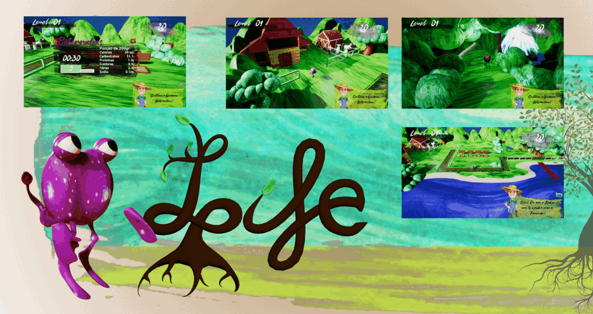
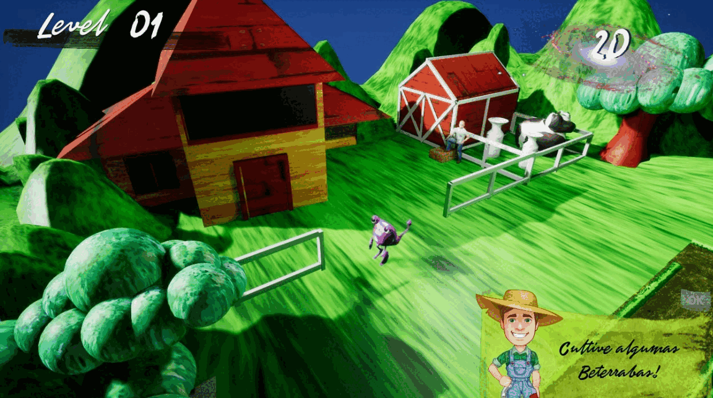
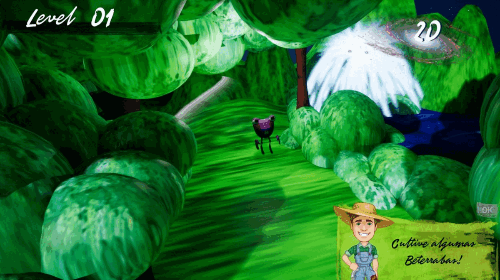
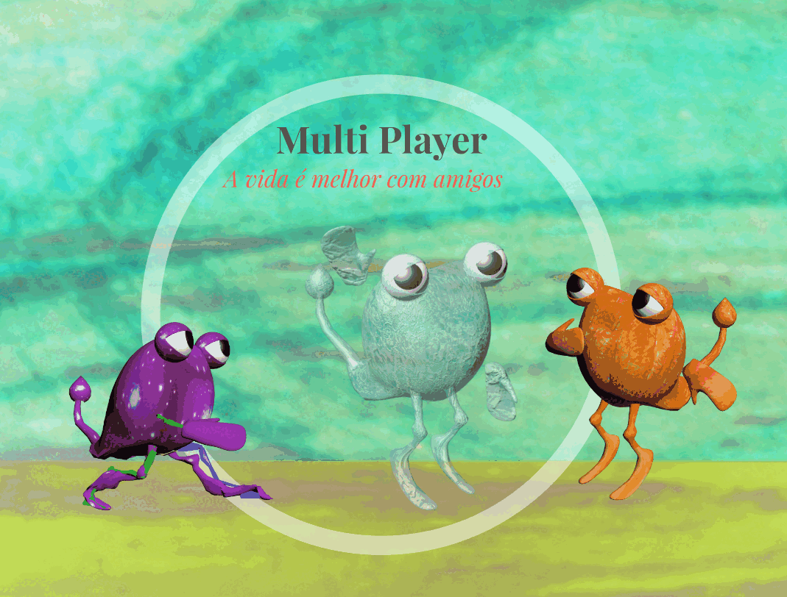
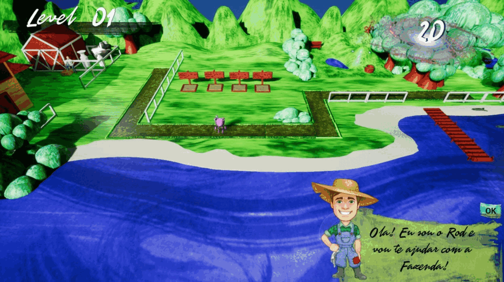
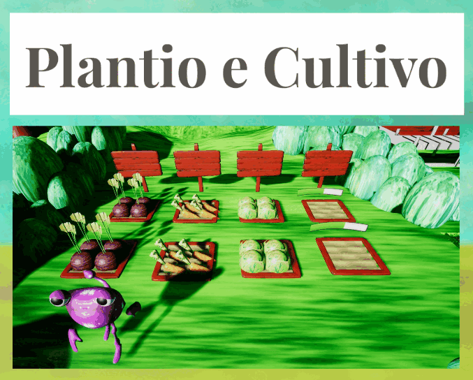
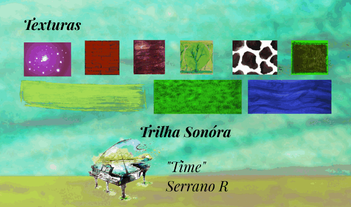

# Life

**Life** é um jogo educativo e acolhedor sobre três alienígenas que vêm à Terra em busca de tratamento oncológico. Durante a jornada, eles descobrem como alimentação equilibrada, movimento, hidratação, descanso e acompanhamento profissional podem apoiar a qualidade de vida durante o tratamento.

O projeto combina duas experiências complementares:

- um jogo 3D com missões personalizadas de autocuidado;
- uma agenda eletrônica para consultas, registro de sintomas e visualização amigável da evolução dos exames.

> **Importante:** Life não substitui diagnóstico, prescrição, tratamento ou acompanhamento médico. As recomendações devem ser validadas por profissionais de saúde e adaptadas à realidade clínica de cada pessoa.

## Conceito

Ao iniciar uma sessão, a pessoa informa como está se sentindo e quais efeitos colaterais percebe. O sistema transforma essas respostas em missões seguras e contextualizadas, sempre dentro de conteúdo previamente validado por especialistas.

Exemplos de missões:

- registrar a ingestão de água;
- preparar ou conhecer uma refeição equilibrada;
- cultivar alimentos e aprender seus benefícios nutricionais;
- fazer uma atividade leve autorizada pela equipe de saúde;
- organizar uma consulta ou lembrete de medicação;
- registrar sintomas para conversar com o profissional responsável.

## Experiência de jogo

- **Três protagonistas alienígenas:** personagens com identidades, necessidades e habilidades próprias.
- **Missões adaptativas:** o estado relatado pelo jogador influencia as atividades oferecidas.
- **Fazenda educativa:** plantar, cultivar e conhecer alimentos faz parte da progressão.
- **Exploração 3D:** ambientes lúdicos conectam narrativa, natureza e educação nutricional.
- **Cooperação:** a proposta multiplayer reforça apoio e convivência durante a jornada.

## Agenda e acompanhamento

O módulo de saúde está planejado para oferecer:

- agenda de consultas, exames e retornos;
- lembretes configuráveis;
- diário de sintomas e efeitos colaterais;
- histórico de bem-estar relatado;
- gráficos simples da evolução de resultados laboratoriais;
- exportação de um resumo para conversa com a equipe assistencial.

Dados de saúde são sensíveis. Uma implementação real deverá adotar consentimento explícito, controle de acesso, criptografia, minimização de dados e conformidade com a LGPD.

## Galeria

| Fazenda e cultivo | Exploração | Personagens |
|---|---|---|
|  |  |  |

| Visão geral da fase | Plantio | Direção de arte e som |
|---|---|---|
|  |  |  |

## Estado do projeto

**Fase atual:** conceito e protótipo visual.

O material deste repositório documenta a visão original e estabelece uma base para redesign, validação clínica e desenvolvimento futuro.

## Próximos passos

- consolidar o Game Design Document;
- definir público, faixa etária e plataforma inicial;
- validar narrativa e missões com oncologista, nutricionista e psicólogo;
- redesenhar a experiência de registro de sintomas;
- criar protótipo navegável da agenda e dos gráficos;
- revisar a identidade visual e reconstruir o protótipo 3D;
- executar testes de acessibilidade, usabilidade e segurança.

## Documentação

- [Visão do produto](docs/PRODUCT_VISION.md)
- [Game Design Document inicial](docs/GDD.md)
- [Saúde, segurança e privacidade](docs/HEALTH_AND_PRIVACY.md)
- [Roadmap](docs/ROADMAP.md)

## Autoria

Conceito e direção: **Ariel Kühn Quint**  
Projeto original: **QiP Games**

## Direitos autorais

Copyright © 2026 Ariel Kühn Quint. Todos os direitos reservados.

O código, os personagens, a narrativa, as imagens e demais materiais deste projeto não podem ser copiados, redistribuídos, modificados ou utilizados comercialmente sem autorização expressa do autor. Consulte [LICENSE.md](LICENSE.md).
